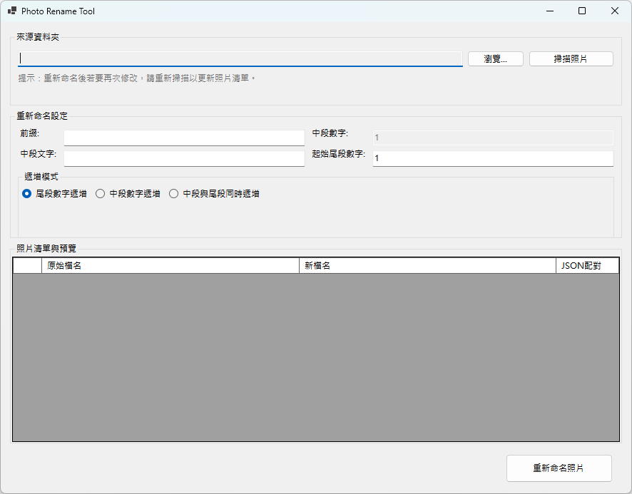

# Photo Rename Agent

Photo Rename Agent 是一個使用 C# / .NET Windows Forms 開發的照片批次重新命名工具，將原有的 Python 工具重新實作為較容易測試與維護的桌面應用程式。

## 功能

- 支援 `.jpg`、`.jpeg`、`.png` 圖片，副檔名不分大小寫
- 自動尋找圖片同名的 `.json` 標記檔
- 圖片與對應 JSON 會一起重新命名
- 沒有 JSON 的圖片仍可單獨處理
- 自訂檔名前綴、中段文字與數字格式
- 支援尾段數字遞增、中段數字遞增，以及中段與尾段同時遞增
- 執行前預覽新的檔名
- 發生碰撞或移動失敗時保留原始檔案，並支援復原

## 使用介面



## 執行環境

- Windows
- .NET SDK 10.0 或更新版本
- Windows Forms 執行環境

## 建置與測試

在專案根目錄執行：

```powershell
dotnet restore .\PhotoRenameAgent.slnx
dotnet build .\PhotoRenameAgent.slnx --nologo
dotnet test .\PhotoRenameAgent.slnx --nologo
```

目前核心測試涵蓋檔名產生、檔案配對、批次重新命名，以及安全移動與復原流程。

## 啟動應用程式

```powershell
dotnet run --project .\src\PhotoRename.App\PhotoRename.App.csproj
```

啟動後，選擇照片資料夾，掃描檔案，設定檔名前綴與數字規則，確認預覽結果後執行重新命名。

## 命名格式

產生的檔名由以下部分組成：

```text
{prefix}{mid_number}{mid_text}{end_number}{extension}
```

例如：

```text
輸入：NY-YG-、448、蛋白質、48
輸出：NY-YG-448_蛋白質_48.jpg
```

數字可依設定補零，例如 `1` 可格式化為 `001` 或 `01`。

## 專案結構

```text
PhotoRenameAgent/
├── src/
│   ├── PhotoRename.App/       Windows Forms 使用者介面
│   └── PhotoRename.Core/      核心模型與重新命名服務
├── tests/
│   └── PhotoRename.Core.Tests/核心單元測試
├── docs/
│   └── Requirements.md        專案需求
├── legacy/
│   └── photo_rename.py        原始 Python 版本
└── PhotoRenameAgent.slnx      .NET 方案檔
```

## Git 分支流程

目前採用兩層流程：

```text
feature/* -> develop -> main
```

- `feature/*`：開發單一功能
- `develop`：整合與測試中的版本
- `main`：已驗證的穩定版本

新功能建議從 `develop` 開分支，完成後透過 Pull Request 合併回 `develop`；確認測試通過後，再合併到 `main`。
